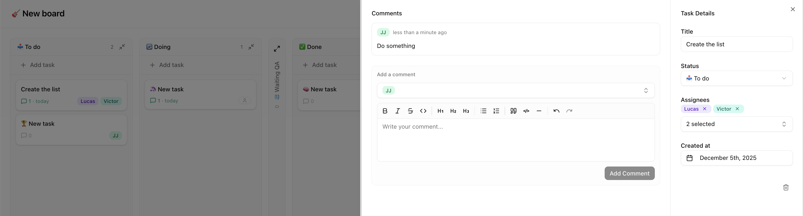

# Itacorubi Kanban

A collaborative Kanban board application built with Next.js.
Create and manage multiple boards with customizable columns, tasks, and team contributors.
Work on cross-company smallprojects without the need for authentication.



## Features

- 📋 **Multiple Boards** — Create and manage separate boards for different projects
- 🗂️ **Customizable Columns** — Add, rename, reorder, and collapse columns
- ✅ **Task Management** — Create tasks with rich text descriptions, due dates, and assignees
- 👥 **Contributors** — Add team members with customizable colors and track their assignments
- 💬 **Comments** — Collaborate on tasks with threaded comments
- 🎨 **Theme Support** — Light, dark, and system-based themes
- 📱 **Mobile Responsive** — Full functionality on any device
- 🚀 **Drag & Drop** — Intuitive task organization powered by dnd-kit

## Tech Stack

- **Framework**: [Next.js 16](https://nextjs.org/) with App Router
- **Database**: [Turso](https://turso.tech/) (SQLite/libSQL) with [Drizzle ORM](https://orm.drizzle.team/)
- **UI Components**: [shadcn/ui](https://ui.shadcn.com/) + [Radix UI](https://www.radix-ui.com/)
- **Styling**: [Tailwind CSS v4](https://tailwindcss.com/)
- **Rich Text**: [Tiptap](https://tiptap.dev/)
- **Drag & Drop**: [@dnd-kit](https://dndkit.com/)

## Getting Started

### Prerequisites

- [Node.js](https://nodejs.org/) 18+
- [pnpm](https://pnpm.io/) (recommended) or npm/yarn

### Run Locally

```bash
# Clone the repository
git clone https://github.com/Superfiliate/itacorubi-kanban.git
cd itacorubi-kanban

# Install dependencies
pnpm install

# Start the development server
pnpm dev
```

Open [http://localhost:5800](http://localhost:5800) in your browser.

That's it! No environment variables needed for local development—the app automatically uses a local SQLite file.

## Deployment

### Deploy to Vercel (Recommended)

1. Push your code to a GitHub repository
2. Import the project in [Vercel](https://vercel.com/)
3. Add a Turso database via the [Vercel Marketplace](https://vercel.com/marketplace)
4. Deploy!

The build process automatically runs database migrations, so your schema stays in sync with each deployment.

### Environment Variables (Production Only)

When deploying with Turso via Vercel Marketplace, these are automatically configured:

| Variable             | Description                    |
| -------------------- | ------------------------------ |
| `TURSO_DATABASE_URL` | Your Turso database URL        |
| `TURSO_AUTH_TOKEN`   | Authentication token for Turso |
